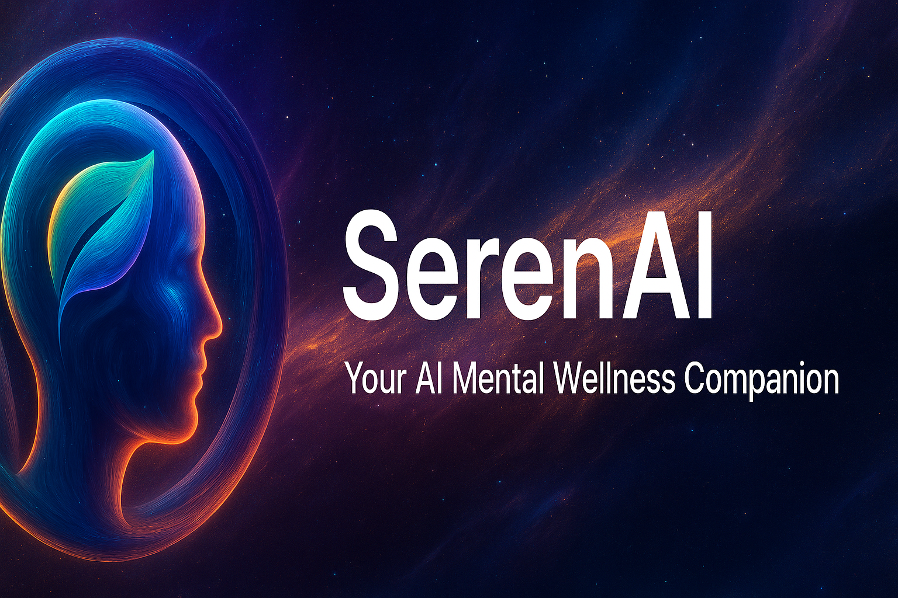

# SerenAI - Your AI Mental Wellness Companion

[](https://nextjs.org/)
[](https://www.typescriptlang.org/)
[](https://tailwindcss.com/)





**Live Demo**: [https://serenai-iota.vercel.app/](https://serenai-iota.vercel.app/)

SerenAI is a cutting-edge mental wellness application that leverages artificial intelligence to provide empathetic support, mood tracking, and personalized insights. Built with Next.js and powered by OpenAI's GPT-4, SerenAI offers a safe space for users to explore their feelings, track their emotional well-being, and receive personalized mental health guidance.

## ✨ Features

### Core Features
- **🤖 AI Chatbot**: Engage in therapeutic conversations with an empathetic AI companion powered by GPT-4
- **📝 Journaling**: Create, edit, and organize journal entries with AI-generated prompts based on your mood
- **📊 Mood Tracking**: Track your emotional patterns with visual charts and insights
- **🧠 Personalized Insights**: AI-powered analysis of your mental wellness journey with actionable suggestions
- **🎯 Wellness Activities**: Guided activities including breathing exercises, meditation, and more with built-in timers

### Advanced Features
- **🔒 Privacy-First**: End-to-end encryption and secure data storage with user privacy as the top priority
- **🌓 Dark/Light Mode**: Seamless theme switching for comfortable use in any lighting
- **📱 Responsive Design**: Fully responsive interface that works beautifully on all devices
- **📈 Analytics Dashboard**: Comprehensive analytics of your mental wellness progress
- **🔔 Smart Notifications**: Customizable reminders and notifications for your wellness journey
- **📤 Data Export**: Export all your data for personal records or to share with healthcare providers
- **🎨 Beautiful UI**: Modern, calming interface designed with mental wellness in mind

## 🛠 Tech Stack

### Frontend
- **Next.js 14** - React framework with App Router
- **TypeScript** - Type-safe JavaScript
- **Tailwind CSS** - Utility-first CSS framework
- **Framer Motion** - Production-ready motion library for React
- **shadcn/ui** - Beautiful and accessible UI components
- **Next-themes** - Theme switching for Next.js
- **Three.js** - 3D graphics library for immersive backgrounds

### Backend
- **Node.js** - JavaScript runtime
- **Next.js API Routes** - Serverless API endpoints
- **OpenAI API** - GPT-4 for AI conversations and analysis
- **Clerk** - Authentication and user management

### Database
- **Neon** - Serverless PostgreSQL database
- **Prisma ORM** - Type-safe database access

### Deployment
- **Vercel** - Deployment platform

## 🚀 Getting Started

### Prerequisites
- Node.js 18+ installed
- npm or yarn package manager
- OpenAI API key
- Clerk authentication keys
- Neon database account

### Installation

1. **Clone the repository**
   ```bash
   git clone https://github.com/yourusername/serenai.git
   cd serenai
   ```

2. **Install dependencies**
   ```bash
   npm install
   ```

3. **Set up environment variables**
   Create a `.env.local` file in the root directory and add the following environment variables:
   ```env
   # Clerk Authentication
   NEXT_PUBLIC_CLERK_PUBLISHABLE_KEY=your_clerk_publishable_key
   CLERK_SECRET_KEY=your_clerk_secret_key

   # OpenAI API
   OPENAI_API_KEY=your_openai_api_key

   # Neon Database
   DATABASE_URL=your_neon_database_url

   # Clerk URLs
   NEXT_PUBLIC_CLERK_SIGN_IN_URL=/sign-in
   NEXT_PUBLIC_CLERK_SIGN_UP_URL=/sign-up
   NEXT_PUBLIC_CLERK_AFTER_SIGN_IN_URL=/dashboard
   NEXT_PUBLIC_CLERK_AFTER_SIGN_UP_URL=/dashboard
   ```

4. **Set up the database**
   ```bash
   # Generate Prisma client
   npx prisma generate

   # Run database migrations
   npx prisma migrate dev

   # (Optional) Seed the database with sample data
   npm run db:seed
   ```

5. **Run the development server**
   ```bash
   npm run dev
   ```

6. **Open your browser**
   Navigate to [http://localhost:3000](http://localhost:3000) to see the application.

## 📁 Project Structure

```
serenai/
├── public/
│   ├── videos/
│   │   └── hero.mp4
│   └── images/
├── src/
│   ├── app/
│   │   ├── (auth)/
│   │   │   ├── sign-in/
│   │   │   └── sign-up/
│   │   ├── api/
│   │   │   ├── auth/
│   │   │   ├── chat/
│   │   │   ├── insights/
│   │   │   ├── journal/
│   │   │   ├── mood/
│   │   │   └── user/
│   │   ├── dashboard/
│   │   │   ├── activities/
│   │   │   ├── chat/
│   │   │   ├── insights/
│   │   │   ├── journal/
│   │   │   ├── mood/
│   │   │   ├── profile/
│   │   │   └── settings/
│   │   ├── globals.css
│   │   ├── layout.tsx
│   │   └── page.tsx
│   ├── components/
│   │   ├── ui/
│   │   ├── dashboard/
│   │   └── landing/
│   ├── contexts/
│   ├── hooks/
│   ├── lib/
│   │   ├── auth.ts
│   │   ├── db.ts
│   │   ├── openai.ts
│   │   └── utils.ts
│   └── types/
├── prisma/
│   ├── migrations/
│   └── seed.ts
├── .env.local
├── .gitignore
├── middleware.ts
├── next.config.js
├── package.json
├── tailwind.config.ts
└── tsconfig.json
```

## 🔧 Scripts

- `npm run dev` - Start development server
- `npm run build` - Build for production
- `npm run start` - Start production server
- `npm run lint` - Run ESLint
- `npm run db:seed` - Seed database with sample data
- `npm run db:studio` - Open Prisma Studio for database management

## 🤝 Contributing

We welcome contributions to SerenAI! Please follow these steps:

1. Fork the repository
2. Create a feature branch (`git checkout -b feature/amazing-feature`)
3. Commit your changes (`git commit -m 'Add some amazing feature'`)
4. Push to the branch (`git push origin feature/amazing-feature`)
5. Open a Pull Request

### Development Guidelines
- Follow the existing code style
- Write meaningful commit messages
- Add tests for new features
- Update documentation as needed

## 📄 License

This project is licensed under the MIT License - see the [LICENSE](LICENSE) file for details.

## 🙏 Acknowledgments

- [OpenAI](https://openai.com/) for providing the powerful GPT-4 API
- [Clerk](https://clerk.com/) for the seamless authentication solution
- [Neon](https://neon.tech/) for the serverless PostgreSQL database
- [Vercel](https://vercel.com/) for the excellent deployment platform
- [shadcn/ui](https://ui.shadcn.com/) for the beautiful UI components

## 📞 Contact

- **Project Link**: [https://github.com/yourusername/serenai](https://github.com/mohitbansal25082006/serenai)
- **Live Demo**: [https://serenai-iota.vercel.app/](https://serenai-iota.vercel.app/)
- **Issues**: [https://github.com/yourusername/serenai/issues](https://github.com/mohitbansal25082006/serenai/issues)

---

**Disclaimer**: SerenAI is designed to provide supportive conversation and mental wellness tracking. It is not a substitute for professional medical advice, diagnosis, or treatment. If you are experiencing a mental health crisis, please contact a crisis hotline or seek professional help immediately.
